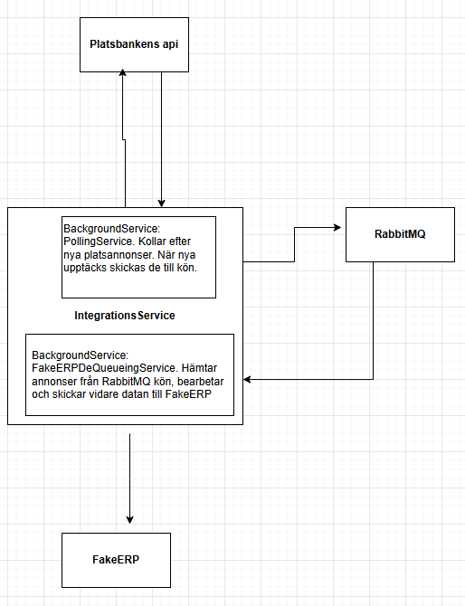

# IntegrationSimulator

## Översikt

Detta är en integrationssimulator byggd med .NET 9 och C# 13. Med detta projekt försöker jag simulera ett så verkligt integrationsscenario som möjligt. Jag använder mig av ett externt API, platsbankens annons API, som får rollen som något slags CRM. Denna applikation pollar API:et för platsannonser till .NET tjänster i Göteborgsområdet. När nya annonser upptäcks hämtas de och skickas till en RabbitMQ-kö. En bakgrundsprocess konsumerar sedan dessa meddelanden och vidarebefordrar platsannonserna till ett (simulerat) ERP-system via HTTP, vilket efterliknar integration med affärssystem. "ERP"-systemet är programmerat att ibland inte vara tillgängligt, vilket kräver att min integrationsapplikation hanterar detta genom omförsök, eller att lägga tillbaka annonser i RabbitMQ kön för att försöka igen senare.

Projektet byggde jag för att träna på kärnkoncept inom integration, såsom polling, meddelandeköer, separation mellan system, felhantering, hållbarhet och containerisering.

## Centrala koncept

- **Integrationsmönster:** Polling, meddelandebaserad separation och vidarebefordran till nedströmssystem.
- **Robusthet:** Retry-logik och felhantering med Polly.
- **Spårbarhet:** Strukturerad loggning och trace-ID.
- **Hållbarhet:** Tillförlitlig meddelandeleverans med RabbitMQ.
- **Utbyggbarhet:** Lätt att anpassa för verkliga CRM/ERP-integrationer.

## Funktioner

- **Polling:** Letar regelbundet efter nya platsannonser från ett publikt API.
- **Förändringsdetektering:** Identifierar och bearbetar endast nya annonser.
- **Message Queueing:** Publicerar nya annonser till en hållbar RabbitMQ-kö för avkopplad hantering.
- **Background service:** Konsumerar meddelanden från kön och skickar dem till ett fejkat ERP-system via HTTP POST.
- **Felhantering:** Robust felhantering och retry-logik med Polly.
- **Loggning:** Använder Serilog för strukturerad loggning till både konsol och fil, med trace-ID för ökad spårbarhet.
- **Konfiguration:** Alla viktiga inställningar är externa för enkel miljöhantering.
- **Hållbarhet:** Säkerställer att meddelanden inte går förlorade med hjälp av hållbara köer och utbyten.
- **Redo för containerisering:** Designad för enkel driftsättning med Docker och Docker Compose.

## Arkitektur

- **IntegrationService:** .NET 9-konsolapp med två huvudsakliga bakgrundstjänster:
  - **PollingService:** Hämtar nya platsannonser och lägger dem i kön.
  - **FakeERPDeQueueingService:** Tar emot meddelanden från kön och integrerar med ERP.
- **RabbitMQ:** Fungerar som meddelandebroker för separation och hållbarhet.
- **FakeERP:** Minimal .NET 9 Web API som simulerar ett ERP-endpoint.

## Kom igång

### Förutsättningar

För att på enklast sätt kunna testa denna applikationen behöver du ha Docker installerat. Docker kan du hämta här: https://docs.docker.com/get-started/get-docker/

### Med Docker Compose

Du kan antingen klona hela repot, eller endast hämta hem docker-compose.yml filen som finns i repots rotmapp. Öppna valfri terminal och navigera till den mappen där docker-compose.yml filen finns. Kör följande kommando: `docker compose up`. Du kommer då kunna följa händelseförloppet i terminalen. För att avsluta programmet matar du in kombinationen: `ctrl + c`.
